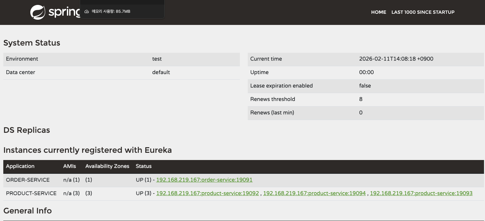
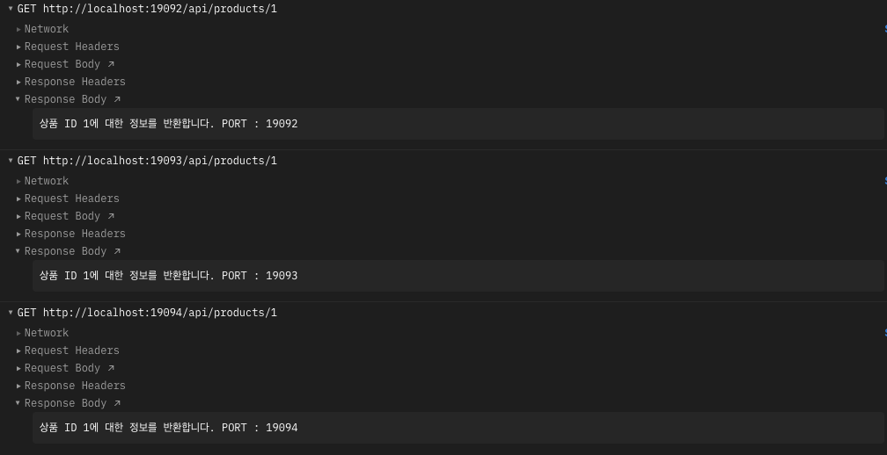
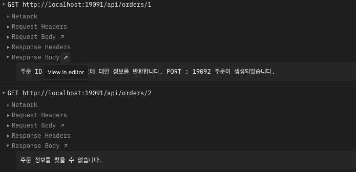
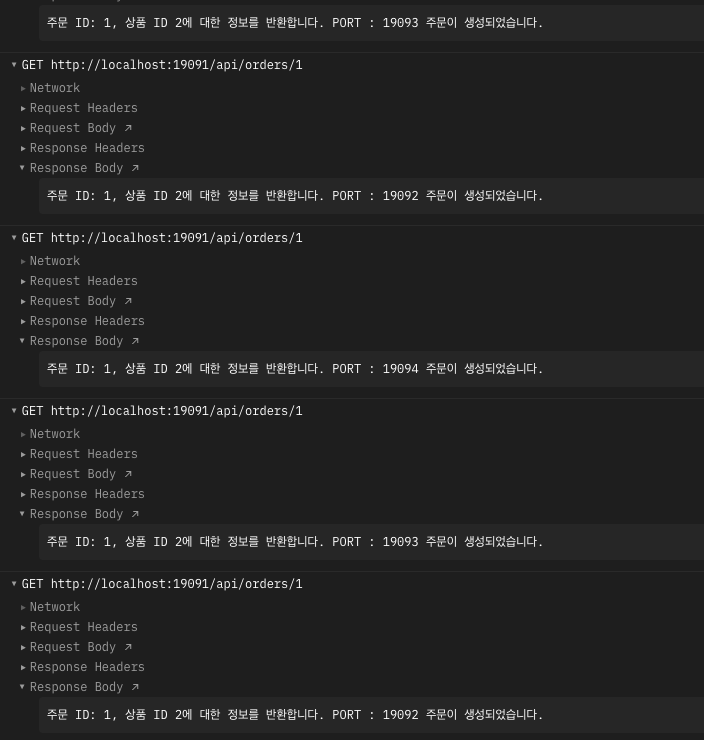

# OpenFeign과 로드밸런싱

## OpenFeign이란?

Spring Cloud OpenFeign은 선언적 HTTP 클라이언트로, 인터페이스와 어노테이션만으로 다른 서비스의 API를 호출할 수 있게 해준다. Eureka와 함께 사용하면 서비스 이름만으로 호출이 가능하고, 별도의 URL 관리가 필요 없다.

## 구현 구조

```
[Order Service] (:19091)
    │
    │  @FeignClient(name="product-service")
    │  ProductClient 인터페이스로 호출
    │
    ├──→ [Product Service] (:19092)
    ├──→ [Product Service] (:19093)   ← Round Robin 로드밸런싱
    └──→ [Product Service] (:19094)
```

Order Service에서 `ProductClient` 인터페이스를 선언하면, OpenFeign이 Eureka에 등록된 `product-service` 인스턴스 중 하나를 선택하여 호출한다.

```java
@FeignClient(name="product-service")
public interface ProductClient {
    @GetMapping("/api/products/{id}")
    String getProductById(@PathVariable Long id);
}
```

## 검증 과정

### Step 1. Eureka에 서비스 등록 확인

Order Service 1개와 Product Service 3개를 실행하고 Eureka Dashboard에서 모든 인스턴스가 UP 상태인지 확인했다.



- ORDER-SERVICE: 1개 인스턴스 (19091)
- PRODUCT-SERVICE: 3개 인스턴스 (19092, 19093, 19094)

### Step 2. Product API 포트별 직접 호출

각 Product 인스턴스에 직접 요청하여 포트별로 정상 응답하는지 확인했다.



- `GET localhost:19092/api/products/1` → `상품 ID 1에 대한 정보를 반환합니다. PORT : 19092`
- `GET localhost:19093/api/products/1` → `상품 ID 1에 대한 정보를 반환합니다. PORT : 19093`
- `GET localhost:19094/api/products/1` → `상품 ID 1에 대한 정보를 반환합니다. PORT : 19094`

각 인스턴스가 자신의 포트를 응답에 포함하여, 어떤 인스턴스가 처리했는지 구분할 수 있도록 했다.

### Step 3. Order API에서 Product 호출 확인

Order Service를 통해 주문을 조회하면 내부적으로 FeignClient가 Product Service를 호출한다.



- `GET localhost:19091/api/orders/1` → `주문 ID: 1, 상품 ID 2에 대한 정보를 반환합니다. PORT : 19092 주문이 생성되었습니다.`
- `GET localhost:19091/api/orders/2` → `주문 정보를 찾을 수 없습니다.`

Order에서 Product를 FeignClient로 호출했을 때 응답에 Product의 포트 번호가 포함되어, 서비스 간 통신이 정상적으로 이루어지는 것을 확인했다.

### Step 4. Round Robin 로드밸런싱 확인

같은 Order API를 반복 호출하여 Product Service의 포트가 순차적으로 바뀌는지 확인했다.



```
1차 호출 → PORT : 19093
2차 호출 → PORT : 19092
3차 호출 → PORT : 19094
4차 호출 → PORT : 19093
5차 호출 → PORT : 19092
```

같은 `GET localhost:19091/api/orders/1`을 반복 호출했을 때, 응답의 PORT가 19092 → 19093 → 19094 순서로 순환하며 바뀌는 것을 확인했다. OpenFeign + Eureka 조합에서 기본으로 **Round Robin** 방식의 로드밸런싱이 적용된다.

## 배운 점

- FeignClient 인터페이스 하나만 선언하면 다른 서비스의 API를 마치 로컬 메서드처럼 호출할 수 있다. URL을 하드코딩할 필요 없이 Eureka에 등록된 서비스 이름(`product-service`)만 지정하면 알아서 찾아간다.
- 별도의 로드밸런서 설정 없이도 OpenFeign + Eureka 조합만으로 Round Robin 로드밸런싱이 자동 적용되었다. 같은 API를 반복 호출하면 3개의 Product 인스턴스에 순차적으로 분배되는 것을 포트 번호로 직접 확인할 수 있었다.