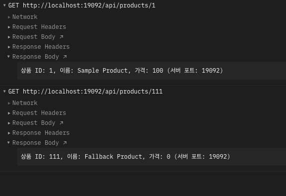
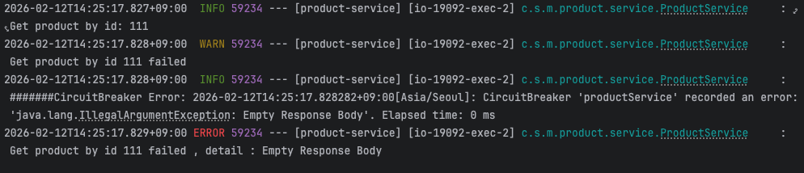

# Circuit Breaker (Resilience4j)

## Circuit Breaker란?

MSA 환경에서 특정 서비스에 장애가 발생했을 때, 연쇄적으로 다른 서비스까지 장애가 전파되는 것을 방지하는 패턴이다. 전기 회로의 차단기처럼, 장애가 감지되면 해당 서비스로의 호출을 차단하고 미리 정의한 fallback 응답을 반환한다.

## 구현 구조

ProductService에 `@CircuitBreaker` 어노테이션을 적용하여, 특정 조건에서 예외가 발생하면 fallback 메서드가 호출되도록 구성했다.

```java
@CircuitBreaker(name="productService", fallbackMethod = "fallbackGetProductDetails")
public Product getProductDetails(Long productId) {
    if(productId == 111L) {
        throw new IllegalArgumentException("Empty Response Body");
    } else {
        return new Product(productId, "Sample Product", 100);
    }
}

public Product fallbackGetProductDetails(Long productId, Throwable t) {
    return new Product(productId, "Fallback Product", 0);
}
```

CircuitBreakerRegistry를 통해 상태 전환, 실패율 초과, 호출 차단, 오류 발생 등의 이벤트를 로깅하도록 리스너도 등록했다.

## 검증 과정

### 정상 요청 vs 장애 요청

`productId=1`로 정상 요청하면 일반 응답이, `productId=111`로 요청하면 fallback 응답이 반환된다.



- `GET localhost:19092/api/products/1` → `상품 ID: 1, 이름: Sample Product, 가격: 100 (서버 포트: 19092)`
- `GET localhost:19092/api/products/111` → `상품 ID: 111, 이름: Fallback Product, 가격: 0 (서버 포트: 19092)`

### 서버 로그 확인

장애 발생 시 CircuitBreaker가 에러를 기록하고 fallback이 실행되는 과정을 로그로 확인했다.



`productId=111`로 요청하면 `IllegalArgumentException`이 발생하고, CircuitBreaker가 이를 감지하여 에러를 기록한 뒤 fallback 메서드가 실행된다.

## 배운 점

서비스에 장애가 발생해도 fallback 응답을 통해 클라이언트에게 정상적인 응답을 줄 수 있다. 에러가 발생한 서비스에 계속 요청을 보내는 대신 차단하고 대체 응답을 반환하는 방식으로, 장애가 다른 서비스로 전파되는 것을 방지한다.